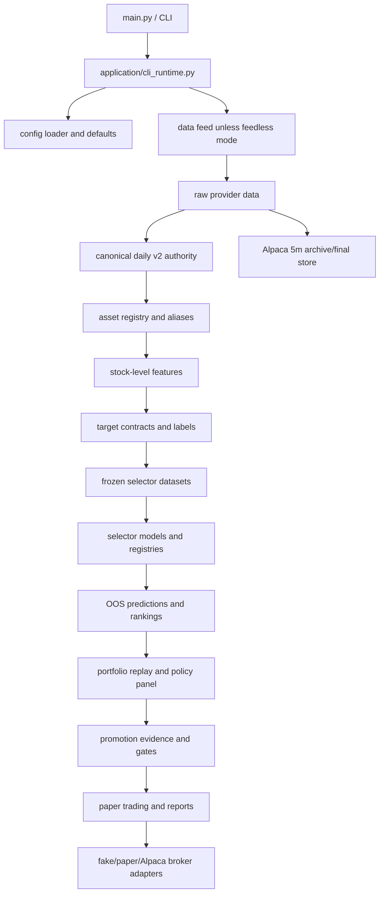
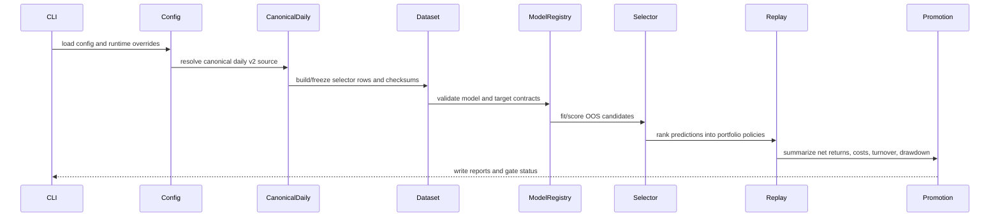

# Complete Developed Trading Pipeline Reference Report

Generated: 2026-07-28T22:38:14.9326159+01:00

Repository: `C:/Users/Brandon/trading_system`

HEAD at inspection: `f1b77c876f4fd2ca3a37b4f5820b077f927110f9`

Branch: `feature/selector-compute-adoption-20260718`

Upstream: `origin/feature/selector-compute-adoption-20260718`

Ahead/behind: `+1 -0`

Inspection mode: read-only repository reconstruction. No expensive jobs, downloads, trading, full test suites, or data-producing pipelines were run.

## 1. Classification

Overall classification: `REFERENCE_COMPLETE_WITH_LIMITATIONS`.

This repository contains a broad research and paper-trading pipeline with real code for data ingestion, canonical market-data lineage, feature and target generation, model registries, stock-selector evaluation, portfolio replay, promotion evidence, paper trading, and operational reporting. It also contains many untracked or ignored research artifacts and late-stage framework modules that materially change the apparent capability surface.

The current checked-out workspace should not be treated as a production-ready or promotion-ready trading authority. Critical controls remain incomplete or unverified: historical point-in-time universe membership, historical asset identity, corporate-action lineage, exact reproducibility from current HEAD, full raw-to-candidate data lineage, DSR/PBO/trial-family accounting, calibrated uncertainty, and execution/fill/adverse-selection modeling.

## 2. Verified Repository State

| Field | Value |
|---|---|
| Root | `C:/Users/Brandon/trading_system` |
| HEAD | `f1b77c876f4fd2ca3a37b4f5820b077f927110f9` |
| Branch | `feature/selector-compute-adoption-20260718` |
| Upstream | `origin/feature/selector-compute-adoption-20260718` |
| Ahead/behind | `+1 -0` |
| Staged changes at inspection start | none |
| Dirty worktree at inspection start | yes |
| Python | `Python 3.11.9` |
| OS | Microsoft Windows 11 Pro 10.0.26200 64-bit |
| Dependency file discovered | `requirements.txt` |

The worktree already contained many tracked modifications, tracked deletions, ignored artifacts, and untracked implementation files before this report was created. This report does not revert or rely on those changes as committed authority unless explicitly labeled.

## 3. Existing Dirty Tree

The initial dirty tree included modified tracked application, configuration, ML, model, replay, reporting, and test files. It also included deleted tracked post-finaliser pipeline files and many untracked authority, monitoring, conformal, retention, and selector-campaign modules.

Important untracked implementation families observed:

| Family | Representative paths | Classification |
|---|---|---|
| Adaptive conformal intervals | `core/research/ml/adaptive_conformal.py`, `core/research/ml/adaptive_conformal_integration.py` | `UNTRACKED_FRAMEWORK` |
| Forecast coverage monitoring | `core/research/ml/forecast_interval_coverage_monitoring.py` | `UNTRACKED_FRAMEWORK` |
| Sequential change-point detection | `core/research/ml/sequential_change_point.py` | `UNTRACKED_FRAMEWORK` |
| PIT universe authority | `core/research/ml/reference/pit_universe_authority.py` | `UNTRACKED_FRAMEWORK` |
| Historical identity authority | `core/research/ml/reference/historical_identity_authority.py` | `UNTRACKED_FRAMEWORK` |
| Dataset build manifests | `core/research/ml/dataset_build_manifest.py` | `UNTRACKED_FRAMEWORK` |
| Full daily selector campaign | `core/research/ml/full_daily_selector_campaign.py` | `UNTRACKED_FRAMEWORK` |
| Daily price portfolio replay | `core/research/ml/stock_level/daily_price_portfolio_replay.py` | `UNTRACKED_FRAMEWORK` |
| Retention evidence/cleanup | `core/research/ml/reference/data_retention_evidence.py`, `core/research/ml/reference/data_retention_cleanup_guard.py` | `UNTRACKED_FRAMEWORK` |

Ignored evidence/artifact directories include `data/`, `cache/`, `reports/`, and `logs/` through `.gitignore`. Those artifacts can prove local historical work occurred, but they are not committed source authority.

## 4. Scope And Methodology

The report was reconstructed from:

| Evidence type | Paths |
|---|---|
| CLI entry and dispatch | `main.py`, `application/cli_parser.py`, `application/cli_runtime.py`, `application/cli_dispatch.py` |
| Config defaults and validation | `config/config_defaults.py`, `config/config_defaults_ml.py`, `config/config_defaults_runtime.py`, `config/config.yaml`, `config/config_validation.py` |
| Registries | `config/ml_registries/*.json` |
| Source modules | `application/`, `core/`, `infrastructure/`, `scripts/` |
| Tests | `tests/` |
| Local artifacts | `reports/`, `data/`, `cache/` |
| Existing docs | `docs/` |

The inspection intentionally avoided:

| Avoided action | Reason |
|---|---|
| Network calls | Provider data should not be refreshed for a reference report. |
| Full tests | The ticket requested no expensive work. |
| Trading/paper submissions | Trading impact must remain none. |
| Data conversion/backfill jobs | Large artifact writes were out of scope. |

## 5. Repository Map

| Area | Purpose | Notes |
|---|---|---|
| `main.py` | Main CLI entrypoint and compatibility exports | Calls `application.cli_runtime.run_cli()` |
| `application/` | CLI parsing, dispatch, services, runtime orchestration | Large mode surface with many feedless research commands |
| `config/` | Default configs, project config, registries, universes | Current `config.yaml` keeps ML and live trading disabled |
| `core/` | Domain entities, research engines, ML modules, paper engine, risk | Most developed logic lives here |
| `infrastructure/` | Data feeds, brokers, imports, market sessions | Alpaca/Stooq/broker adapters and NYSE session helpers |
| `scripts/` | Offline utilities, audits, data processing helpers | Mixed tracked/untracked/legacy support |
| `tests/` | Unit and integration tests | 289 `test_*.py` files found |
| `data/` | Ignored local data authority/artifacts | Contains canonical daily and reference assets locally |
| `reports/` | Ignored local evidence and run reports | Contains lineage, audit, ML, and paper artifacts locally |
| `cache/` | Ignored local feature/cache artifacts | Non-authority unless explicitly promoted by manifest |

## 6. High-Level Pipeline

## 7. CLI Entrypoint And Runtime

The CLI starts at `main.py`, imports runtime helpers, and delegates to `application.cli_runtime.run_cli()`.

`application/cli_runtime.py`:

| Responsibility | Evidence |
|---|---|
| Parse mode and options | `build_parser()` from `application/cli_parser.py` |
| Load config | `load_config(args.config, overlay_project_config=True)` |
| Apply research profile and runtime overrides | `apply_research_profile_overrides`, `apply_runtime_overrides` |
| Attach config path | `config["config_path"]` |
| Build data feed for non-feedless modes | `build_data_feed(config)` |
| Dispatch command | `dispatch_mode(args, config, feed)` |

`FEEDLESS_MODES` contains 86 modes, mostly ML research, data lineage, selector, news, and paper/report commands. These modes can run without constructing a live market data feed.

## 8. CLI Mode Inventory

118 parser modes were found. Grouped inventory:

| Group | Modes |
|---|---|
| Traditional research | `backtest`, `optimize`, `walk-forward`, `compare-strategies`, `data-audit`, `dataset-audit`, `relative-strength`, `dual-momentum`, `dual-momentum-walk-forward`, `dual-momentum-risk-regimes`, `dual-momentum-diagnosis`, `multi-strategy`, `multi-strategy-walk-forward`, `champion-robustness` |
| Paper trading | `paper-trade`, `paper-fill`, `paper-status`, `paper-report`, `paper-trading`, `paper-dry-run`, `paper-trial`, `paper-weekly-summary`, `paper-promotion-checklist`, `paper-run`, `paper-repair`, `paper-reset` |
| ML governance and lineage | `ml-model-contract-audit`, `ml-run-inventory`, `ml-clean-incomplete-runs`, `ml-validate-artifacts`, `ml-artifact-lineage-verify`, `ml-dataset-lineage-check`, `ml-registry-verify`, `ml-legacy-artifact-evidence-import`, `ml-smoke-test`, `ml-data-inventory`, `ml-data-retention-check`, `ml-data-retention-build-evidence` |
| Data ingestion and authority | `import-stooq-bulk`, `import-market-parquet`, `ml-historical-bar-backfill-probe`, `ml-historical-bar-backfill-collect`, `ml-historical-bar-backfill-benchmark`, `ml-historical-bar-feed-overlap`, `ml-build-universes`, `ml-refresh-adjusted-prices`, `ml-expanded-rebalance-dataset` |
| Selector datasets and components | `ml-selector-evaluation-preflight`, `ml-selector-panel-resolve`, `ml-selector-artifact-audit`, `ml-selector-component-preflight`, `ml-selector-dataset-lineage-audit`, `ml-selector-parent-gate`, `ml-selector-component-publish`, `ml-selector-spine-validate`, `ml-selector-dataset-validate`, `ml-selector-dataset-build-preflight`, `ml-selector-bounded`, `ml-selector-final-fit`, `ml-selector-exposure-comparison` |
| Stock selector and portfolio | `ml-stock-level-alpha-benchmark`, `ml-stock-selector-bounded`, `ml-stock-selector-final-fit`, `ml-selector-portfolio-promotion`, `ml-selector-target-tournament`, `ml-selector-cost-aware-policy-evaluation`, `ml-selector-confidence-ensemble`, `ml-selector-feature-ablation`, `ml-selector-universe-integrity-audit`, `ml-full-daily-selector-campaign`, `ml-stock-level-target-comparison`, `ml-stock-level-portfolio-replay`, `ml-stock-selector-rebalance-dataset`, `ml-stock-level-portfolio-policy-sweep`, `ml-stock-level-feature-attribution`, `ml-stock-level-alpha-features`, `ml-overnight-stock-alpha` |
| Fundamentals | `ml-stock-fundamentals-preflight`, `ml-stock-fundamentals-collect`, `ml-stock-fundamentals-normalize`, `ml-stock-fundamentals-audit`, `ml-stock-fundamentals-snapshots`, `ml-stock-fundamentals-enrich`, `ml-stock-fundamentals-pipeline` |
| News and NLP | `ml-stock-alpha-news-features`, `ml-stock-alpha-news-feature-diagnostics`, `ml-stock-alpha-news-contract-ingest`, `ml-stock-alpha-news-collect-free-sources`, `ml-stock-alpha-news-collection-plan`, `ml-stock-alpha-news-historical-backfill`, `ml-stock-alpha-news-canonical-corpus`, `ml-stock-alpha-news-daily-confirmation`, `ml-stock-alpha-news-coverage-audit`, `ml-stock-alpha-news-risk-overlay-research`, `ml-stock-alpha-news-risk-overlay-inspect`, `ml-stock-alpha-news-risk-overlay-parallel-benchmark`, `ml-stock-alpha-news-provider-audit`, `ml-stock-alpha-news-provider-sample-check`, `ml-stock-alpha-news-pipeline-preflight`, `ml-stock-alpha-news-pipeline-inspect`, `ml-stock-alpha-news-readiness-preflight`, `ml-stock-alpha-news-source-diagnostics`, `ml-stock-alpha-news-source-setup-check`, `ml-stock-alpha-finbert-news-probe` |
| ML research orchestration | `ml-research`, `ml-research-batch`, `ml-online-intraday-benchmark`, `ml-meta-ensemble`, `ml-return-mechanics-audit`, `ml-benchmark-return-audit`, `ml-dual-momentum-stock-score-comparison`, `ml-stock-alpha-experiment-report`, `ml-stock-alpha-candidate-report`, `ml-stock-alpha-deep-diagnostics`, `ml-stock-alpha-ensemble`, `ml-stock-alpha-ensemble-portfolio-sweep`, `ml-stock-alpha-experiment-preflight`, `ml-stock-alpha-dev-smoke`, `ml-stock-alpha-parallelism-audit`, `ml-stock-alpha-run-status` |

Dispatch gap found: the parser accepts `ml-selector-spine-validate`, `ml-selector-dataset-validate`, and `ml-selector-dataset-build-preflight`, but no explicit dispatch mapping was observed for those parser modes. They risk falling through to default base-backtest behavior if not handled elsewhere.

## 9. Configuration And Defaults

Current default posture:

| Config area | Current default |
|---|---|
| `ml.enabled` | `false` |
| `ml.mode` | `research` |
| ML historical data provider | `stooq_parquet` |
| `paper_trading.enabled` | `false` |
| `paper_trading.submit_orders` | `false` |
| `trading.mode` | `paper` |
| `trading.live_enabled` | `false` |
| broker adapter | `fake` unless configured otherwise |
| risk kill switch | enabled in config |
| stock portfolio replay subsettings | enabled for opt-in ML modes |
| stock portfolio policy sweep subsettings | enabled for opt-in ML modes |
| adaptive conformal challenger | disabled |
| sequential change-point detection | disabled |
| forecast interval coverage monitoring | disabled |
| stock fundamentals | disabled |
| stock-alpha news sentiment | disabled |

Interpretation: the repository defaults are defensive. ML research can be run through explicit modes, but ML is not default-enabled globally, live trading is not enabled, and broker submission is not enabled.

## 10. Data Provider Surface

| Provider | Evidence | Role | Default/production status |
|---|---|---|---|
| Alpaca bars | `infrastructure/alpaca/`, `application/services/historical_bar_backfill_commands.py` | Market data feed and historical bar backfill | Requires credentials; backfill explicit |
| Alpaca broker | `infrastructure/brokers/alpaca_broker.py` | Broker adapter | Not default; live disabled |
| Fake broker | `infrastructure/brokers/fake_broker.py` | Local paper/test broker | Default safe adapter |
| Stooq | `application/services/stooq_bulk_commands.py`, ML defaults | Bulk daily historical data import/provider | ML default historical provider |
| Yahoo chart adjusted close | `data/reference/adjusted_prices/manifest.json` | Adjusted close reference collection | Research-only, not trading impact |
| SEC companyfacts | `core/research/ml/stock_level/stock_fundamentals.py` | Fundamental raw/normalized/snapshot/enrichment pipeline | Disabled by default |
| SEC EDGAR/submissions | `core/research/ml/stock_level/news_sources/providers.py` | Official filing news/event metadata | Adapter available; disabled by default |
| Alpaca/Benzinga news | `core/research/ml/stock_level/news_sources/alpaca.py`, `providers.py` | Editorial news adapter | Requires keys/entitlement; disabled by default |
| Alpha Vantage news sentiment | `providers.py` | News sentiment adapter | Needs key; disabled by default |
| Finnhub | `providers.py` | Company news adapter | Needs key; disabled by default |
| Financial Modeling Prep | `providers.py` | Stock news adapter | Paid/key; disabled by default |
| NewsAPI | `providers.py` | Broad news adapter | Upgrade/key; disabled by default |
| GDELT | `providers.py`, `gdelt.py` | Free web-news index | Experimental; disabled by default |
| Company RSS/IR | `news_sources/rss.py`, `config/news_source_registry.stock_alpha_rss.yaml` | Official company press-release RSS | Adapter available; registry required; disabled by default |

## 11. Storage Layers And Retention Families

`config/data_retention_authority_manifest.v1.json` is the main retained authority manifest. It records current canonical and non-canonical data families, estimated sizes, authority role, and unresolved-delete status.

| Family | Root | Authority classification | Local evidence |
|---|---|---|---|
| Alpaca raw 5m archive | `data/raw/alpaca/stock_bars/sip/5m` | Raw immutable authority, external-provider-dependent | about 1.95 GiB in manifest |
| Alpaca converted chunks | `data/processed/alpaca/stock_bars_parquet/sip/5m` | Non-canonical intermediate | about 3.07 GiB in manifest |
| Alpaca final 5m store | `data/processed/alpaca/symbol_bars/sip/5m` | Canonical intraday consumer store when manifest-complete | about 6.85 GiB in manifest |
| Legacy raw 5m text | `data/raw/5m/5 min/us` | Unknown, do not delete | about 2.86 GiB in manifest |
| Canonical daily v2 | `data/processed/market_data/canonical_daily_v2/full` | Canonical normalized authority | complete lineage manifest |
| ML feature banks | `cache/ml/features` | Cache, non-authority | about 2.84 GiB in manifest |
| Frozen experiment inputs | `reports/ml/readiness/*/frozen` | Frozen evidence | about 1.01 GiB in manifest |
| Reproducibility-critical reports | `reports/` selected roots | Retain | manifest-governed |
| Model binaries | local model/cache roots | Retain if needed for reproducibility | FinBERT class of artifacts |

Unresolved families in the manifest include legacy 5m text, seven-row canonical daily repair candidate, market parquet daily store, legacy processed symbol trees, adjusted-price CSV collection, ML feature banks, and regenerable report runs.

## 12. Canonical Daily Market Data

Primary local evidence:

| Artifact | Value |
|---|---|
| Manifest | `reports/data_lineage/canonical_daily_v2/build_manifest.json` |
| Dataset root | `data/processed/market_data/canonical_daily_v2/full` |
| Status | `COMPLETE` |
| Schema | `canonical_daily_v2.partitioned.v1` |
| Row count | 4,132,023 |
| Symbol count | 514 |
| Date range | 1962-01-02 to 2026-07-10 |
| Completed/planned | 514/514 |
| Failed/pending | 0/0 |
| Quarantined rows | 447 |
| Provider transitions | 514 |
| Price bridge rows | 504 |

This is the strongest local market-data authority currently visible. The data and reports are ignored by git, so they are local evidence rather than committed source.

## 13. Intraday Bar Data

Intraday support is centered on Alpaca 5-minute bars.

| Layer | Evidence | Status |
|---|---|---|
| Backfill probe/collect/benchmark CLI | `application/services/historical_bar_backfill_commands.py` | Implemented |
| Raw chunk conversion | `scripts/convert_completed_alpaca_raw_chunks_to_parquet.py` | Implemented helper |
| Session diagnostics | `infrastructure/data/historical_bar_session_diagnostics.py` | Implemented |
| Final 5m store | `data/processed/alpaca/symbol_bars/sip/5m` | Local manifest-retained authority when complete |
| Parent-order blocker | `generate_layer_b_parent_orders()` requires completed 5m bars | Framework evidence |

The retention manifest distinguishes raw Alpaca evidence, converted chunks, and final intraday consumer store. It also warns that legacy raw 5m text remains unknown and should not be deleted without diff evidence.

## 14. Market Calendar And Session Authority

`infrastructure/data/market_sessions.py` implements:

| Functionality | Details |
|---|---|
| RTH session classification | pre-market, RTH, after-hours |
| Trading session enumeration | weekdays minus NYSE holidays |
| Previous/next trading session | date iteration |
| RTH close | normal close and early close |
| Expected RTH timestamps | UTC timestamps at a configured step |
| Calendar years | implemented for 2016-2026 |
| Special full closures | 2018-12-05 and 2025-01-09 |

Limitation: this is a compact embedded NYSE calendar, not a complete exchange-calendar authority beyond 2026. Historical data before 2016 or future schedules after 2026 require extension or a formal calendar source.

## 15. Asset Identity And Symbol Mapping

Tracked static reference evidence:

| Artifact | Count |
|---|---:|
| `data/reference/assets/canonical_asset_registry.csv` | 514 rows |
| `data/reference/assets/provider_symbol_aliases.csv` | 2,570 rows |
| `data/reference/assets/canonical_asset_registry.parquet` | present |

`core/research/ml/reference/canonical_assets.py` defines canonical assets, provider aliases, dataset manifest helpers, symbol normalization, Alpaca provider symbol conversion, `canonical_asset_id`, row-id helpers, validation, audit, and registry publication blockers.

Current limitation: local asset registry rows observed in audit evidence use static/open-ended identities with `valid_from=1900-01-01`, `is_active=true`, and many `security_type=UNKNOWN` values. That is useful for current-symbol joining, but it is not a promotion-grade historical identity authority.

## 16. PIT Universe Membership

`core/research/ml/reference/pit_universe_authority.py` is present as untracked workspace code. It defines records for security master, membership intervals, symbol history, corporate actions, static universe assets, and a `PointInTimeUniverseAuthority`.

Classification: `UNTRACKED_FRAMEWORK`.

This indicates developed design and tests for point-in-time membership, but it was not committed source at inspection time. Ticket 56 audit evidence also classified historical universe membership as unresolved/current static. Any selector result that uses only a current/static universe should be treated as survivorship-biased until regenerated against committed PIT membership authority.

## 17. Historical Identity And Corporate Actions

`core/research/ml/reference/historical_identity_authority.py` is present as untracked workspace code. It defines permanent asset identity, historical symbol records, provider alias records, company name records, corporate-action lineage events, historical identity authority loading, PIT result enrichment, and traversal helpers.

Classification: `UNTRACKED_FRAMEWORK`.

The retention manifest separately lists intended future authorities for PIT security master, corporate-action lineage, and adjusted price reconciliation. Current evidence does not support treating historical symbol changes, delistings, splits, mergers, or spinoffs as solved production controls.

## 18. Adjusted Prices

Local adjusted-price evidence:

| Artifact | Value |
|---|---|
| Root | `data/reference/adjusted_prices` |
| CSV files currently present | 359 |
| Manifest requested/imported symbols | 28 |
| Manifest latest date | 2026-06-25 |
| Source | Yahoo finance chart adjusted close |
| Trading impact | none |
| Research-only | true |

Risk: the number of CSV files present exceeds the manifest's requested/imported symbol count, so the directory is not a clean standalone authority without additional reconciliation.

## 19. Feature Engineering

Primary stock-level feature module: `core/research/ml/stock_level/stock_level_alpha_features.py`.

Representative feature families:

| Family | Examples |
|---|---|
| Momentum core/extended | trailing returns, momentum persistence, trend fit |
| Drawdown and downside | distance from high, drawdown, recovery, downside deviation, ulcer-style measures |
| Volatility | trailing volatility, volatility percentile, ATR percentile |
| Liquidity | volume and dollar-volume style measures |
| Cross-sectional rank | daily ranks and percentiles |
| Market/sector/industry relative | relative strength and differences |
| Regime context | broad market/breadth context |
| Fundamentals optional | growth, profitability, quality, balance sheet, shareholder actions, valuation, freshness |

The selector feature schema `config/selector_features/canonical_v2_daily_tree_cross_sectional_v1.json` is used by registry entries and ranking contracts. Feature use must preserve point-in-time cutoffs.

## 20. Fundamentals Pipeline

Primary module: `core/research/ml/stock_level/stock_fundamentals.py`.

Implemented stages:

| Stage | Evidence |
|---|---|
| Preflight | `write_stock_fundamentals_preflight` |
| Collect | `SecCompanyFactsProvider`, SEC companyfacts paths |
| Normalize | normalized facts and formula contracts |
| Audit | coverage and raw-cache validation |
| Snapshots | availability and decision timestamps |
| Enrich | feature enrichment for stock-level artifacts |
| Full pipeline | wrapper command stage |

Important controls observed include availability timestamps, future-filing exclusion counts, silent zero-fill guards, raw cache validation, and snapshot freshness. Current default: disabled.

## 21. News And Event Data Pipeline

Primary news modules are under `core/research/ml/stock_level/news_sources/` and `core/research/ml/stock_level/stock_alpha_news_*`.

Developed stages:

| Stage | Evidence |
|---|---|
| Provider planning | `news_sources/registry.py`, `provider_candidate_planning.py` |
| Provider adapters | `providers.py`, `alpaca.py`, `gdelt.py`, `rss.py` |
| Contract ingest | `stock_alpha_news_contract_ingest` command/module |
| Historical backfill | `stock_alpha_news_historical_backfill.py` |
| Canonical corpus | `news_sources/historical_canonical_corpus.py` |
| Daily confirmation | stock-alpha news daily confirmation command |
| Coverage audit | `stock_alpha_news_coverage_audit.py` |
| Feature generation | stock-alpha news features/diagnostics |
| Risk overlay research | stock-alpha news risk overlay modules |
| Provider audit/sample | `stock_alpha_news_provider_audit.py`, sample check |
| Readiness/preflight | news pipeline readiness and source setup checks |
| FinBERT probe | `ml-stock-alpha-finbert-news-probe` mode |

The canonical news contract records raw provider provenance and provider availability fields. Provider collection, canonical ingest, and feature generation are disabled by default in provider planning metadata.

## 22. Target And Label Contracts

Primary registry: `config/ml_registries/target_contracts.v1.json`.

| Target | Status |
|---|---|
| `forward_return_1d` | `IMPLEMENTED_AND_AUTHORITATIVE_RUNNABLE` |
| `forward_return_5d` | `IMPLEMENTED_AND_AUTHORITATIVE_RUNNABLE` |
| `forward_return_10d` | `IMPLEMENTED_AND_BOUNDED_RUNNABLE` |
| `forward_return_20d` | `IMPLEMENTED_AND_AUTHORITATIVE_RUNNABLE` |
| `market_residual_return_10d` | `IMPLEMENTED_BUT_UNVALIDATED` |
| `benchmark_return_10d` | `IMPLEMENTED_BUT_UNVALIDATED` |
| `rank_normalized_forward_return_10d` | `IMPLEMENTED_BUT_UNVALIDATED` |
| `top_decile_label_10d` | `IMPLEMENTED_BUT_UNVALIDATED` |
| `future_volatility` | `IMPLEMENTED_BUT_UNVALIDATED` |
| `future_drawdown` | `IMPLEMENTED_BUT_UNVALIDATED` |
| `direction_10d` | `PARTIAL_IMPLEMENTATION` |
| `should_reduce_exposure` | `IMPLEMENTED_BUT_UNVALIDATED` |

Registry default target provenance is `stock_level_target_provenance_v2`. Ticket 56 audit found older preserved candidate artifacts using `stock_level_target_provenance_v1`, which blocks clean current certification.

## 23. Frozen Dataset And Dataset Manifests

Local frozen selector dataset evidence:

| Field | Value |
|---|---|
| Manifest | `reports/ml/readiness/canonical_v2_selector_dataset_v1/frozen/manifest.json` |
| Dataset id | `canonical_v2_selector_dataset_v1` |
| Feature contract | `canonical_v2_selector_dataset_v1` |
| Target contract | `stock_level_target_provenance_v4` |
| Source row count | 3,224,797 |
| Source symbol count | 406 |
| Source path | `reports/ml/development/ticket_7b3_daily_large_history/regeneration_canonical_v2/benchmark/stock_level_prediction_artifacts_enriched.parquet` |
| Frozen artifact checksums | present for rows, baseline scores, schemas |
| Recorded git commit | `848d144f907f7b2c8ec22a52c23dd6c7d2810606` |

`core/research/ml/dataset_build_manifest.py` is untracked framework code for generic dataset-build manifests and stale-parent guards. Classification: developed but not committed.

## 24. Walk-Forward, Purge, Embargo, And Label Maturity

`core/research/ml/stock_level_benchmark_execution.py` builds expanding-window partitions using `ExpandingWindowSplitter` and `ExpandingWindowSpec`.

Controls observed:

| Control | Evidence |
|---|---|
| Expanding-window split | `ExpandingWindowSplitter` |
| Embargo | `embargo_dates` argument |
| Label maturity | training rows filtered where `label_available_timestamp` is at or before decision timestamp |
| Purged-row count | `purged_count` tracked |
| Empty fold fail-closed | raises if no label-eligible training rows |
| Thread limiting | `threadpoolctl` when native thread limit is set |

The selector research protocol freezes purge and embargo values: 20 purge sessions and 5 embargo sessions in `selector_research_protocol.v1`.

## 25. Sequence Window Authority

Untracked module: `core/research/ml/data/sequence_window_authority.py`.

Implemented controls:

| Control | Evidence |
|---|---|
| Authority version | `sequence_window_authority_v1` |
| Entity isolation | tests prevent crossing adjacent global symbols |
| Stable IDs | sequence ID and deterministic lineage hash |
| Chronology | sorted per entity and timestamp |
| Variant/horizon/split boundary checks | rejects mixed contexts |
| Gap/duplicate/missing-bar checks | rejection reasons in tests |
| Ticker-change allowance | only with explicit stable identity allowance |
| Corporate identity discontinuity | breaks windows |
| Feature cutoff/target leakage | rejects future feature cutoff and target leakage |

`core/research/ml/data/sequence_dataset.py` currently imports the authority and attaches `sequence_window_metadata` to predictions. Because the authority module is untracked, sequence-safety should be considered developed but not committed production authority.

## 26. Model Registry

Primary model registry: `config/ml_registries/selector_models.v1.json`.

| Class | Models | Status |
|---|---|---|
| Deterministic baselines | `momentum_120d`, `risk_adjusted_momentum` | `BASELINE_COMPLETE` |
| Bounded tabular models | `ridge`, `elastic_net`, `random_forest`, `gradient_boosting` | `IMPLEMENTED_AND_BOUNDED_RUNNABLE` |
| Ranking model | `ordered_logit_ranker` | `IMPLEMENTED_AND_BOUNDED_RUNNABLE` |
| Authoritative tabular/linear challengers | `huber`, `contextual_elastic_net`, `multi_horizon_ridge`, `multi_horizon_elastic_net`, `multi_horizon_ordered_logit`, `lightgbm_rank_xendcg`, `lightgbm_lambdarank` | `IMPLEMENTED_AND_AUTHORITATIVE_RUNNABLE` |
| Sequence models | `dlinear`, `patchtst`, `transformer`, `itransformer`, `momentum_transformer`, `multitask_transformer`, `market_context_encoder`, `temporal_fusion_transformer` | `IMPLEMENTED_BUT_UNVALIDATED` |
| News transformer | `news_analysis_transformer` | `BLOCKED_BY_DATA` |

All registry entries are research-only. Sequence model registry entries require PIT controls and are not bounded-runner authoritative.

## 27. Model Implementations

Representative implementation owners:

| Model/family | Evidence |
|---|---|
| Ridge/elastic net/random forest/gradient boosting | `core/research/ml/stock_level_benchmark_models.py` |
| Huber selector | `core/research/ml/stock_level/huber_selector.py` |
| Contextual elastic net | `core/research/ml/stock_level/contextual_elastic_net_selector.py` |
| Multi-horizon linear | `core/research/ml/stock_level/multi_horizon_linear_selector.py` |
| LightGBM production selectors | `core/research/ml/stock_level/lightgbm_production_selector.py` |
| Ordered logit ranker | `core/research/ml/ranking.py` |
| Sequence wrappers | `core/research/ml/models/*`, `core/research/ml/stock_level/stock_level_sequence_regressors.py` |

The implementation surface is broad. Current evidence supports many runnable research paths, but not blanket production promotion.

## 28. Ranking, Scoring, And Calibration

Ranking contracts: `config/ml_registries/ranking_contracts.v1.json`.

| Contract | Purpose |
|---|---|
| `daily_cross_sectional_ranking_problem_v1` | Daily grouped ranking by decision timestamp |
| `within_date_quintile_relevance_v1` | Ordinal quintile labels |
| `within_date_decile_relevance_v1` | Ordinal decile labels |

The current dominant selector prediction semantics are cross-sectional scores, not calibrated expected returns. Ticket 56 audit found no calibration, conformal, forecast interval, or uncertainty artifact for the selected candidate it reviewed.

## 29. Forecast, Signal, And Target Position Contracts

The runtime execution domain has simple entities:

| Entity | Path | Fields |
|---|---|---|
| `Signal` | `core/entities/signal.py` | `symbol`, `action`, `timestamp`, `confidence`, `reason` |
| `Order` | `core/entities/order.py` | `symbol`, `side`, `quantity`, `timestamp`, `order_type`, `limit_price` |
| `Position` | `core/entities/position.py` | `symbol`, `quantity`, `avg_price` |

Research modules contain richer target-weight and parent-order artifacts:

| Contract | Evidence |
|---|---|
| `persistent_daily_price_portfolio_replay.v1` | `core/research/ml/stock_level/daily_price_portfolio_replay.py` |
| `selector_parent_orders.layer_b.v1` | `generate_layer_b_parent_orders()` |
| `horizon_aligned_portfolio_policy.v1` | `config/ml_registries/portfolio_policies.v1.json` |
| `ForecastObservation` style records | untracked conformal and coverage monitoring modules |

No committed shared `Forecast` or `TargetPosition` dataclass was found that links model outputs directly into live broker execution. This is a key integration boundary.

## 30. Portfolio Policy Registry

Primary registry: `config/ml_registries/portfolio_policies.v1.json`.

| Class | Policies | Status |
|---|---|---|
| Legacy replay/sweep policies | long-only top-N/top-decile/score-weighted/vol-scaled, long-short top-bottom, percentile weighted | `IMPLEMENTED_BUT_UNVALIDATED` through registry defaults |
| Daily top-k/rebalance evaluation policies | `daily_top_k_equal_weight_v1`, `staggered_10_session_cohorts_v1`, `top_k_rank_hysteresis_v1`, `long_only_rank_percentile_weighted_v1` | `IMPLEMENTED_BUT_UNVALIDATED` |
| Authoritative policy panel | `daily_top20_control`, `staggered_10_session_top10`, `staggered_10_session_top20`, `staggered_10_session_top40`, `rank_hysteresis_20_30`, `turnover_penalised_aim_v1` | `IMPLEMENTED_AND_AUTHORITATIVE_RUNNABLE` |

Authoritative policy contracts include selection size, holding horizon, maximum stock/sector weights, maximum turnover, cost bps, ADV participation limits, and linear one-way turnover cost model.

## 31. Portfolio Construction And Replay

Tracked research replay module: `core/research/ml/stock_level/stock_level_portfolio_replay.py`.

Untracked daily replay module: `core/research/ml/stock_level/daily_price_portfolio_replay.py`.

Replay controls observed:

| Control | Evidence |
|---|---|
| Sequential NAV from cash, positions, fills | daily replay `pnl_source` |
| Target labels not directly used for PnL | `target_labels_used_for_pnl=false` |
| Costs on fills | `cost_bps + slippage_bps` applied to turnover/trade value |
| Turnover caps | policy turnover cap and scaling |
| Hysteresis | default Ticket 7 daily policy retains until exit rank |
| Benchmark consistency | benchmark prices required for replay dates |
| Holdout protection | replay rejects final holdout dates |
| Artifact identity | manifest checksum reuse and incompatibility guard |

## 32. Execution, Fill, And Parent Orders

Live/runtime execution:

| Component | Evidence | Model |
|---|---|---|
| Simple execution model | `core/execution/simple_execution_model.py` | spread plus random slippage |
| Fake broker | `infrastructure/brokers/fake_broker.py` | local fills with slippage/commission |
| Alpaca broker | `infrastructure/brokers/alpaca_broker.py` | external order adapter |
| Paper trading broker layer | `application/services/paper_trading_broker.py` | broker selection, submission, reconciliation |

Research parent-order framework:

| Field | Evidence |
|---|---|
| Parent order contract | `selector_parent_orders.layer_b.v1` |
| Fill model label | `deterministic_5m_baseline_v1` |
| Partial-fill policy | `allow_partial_with_residual_report` |
| Slippage/cost model | configured linear bps |
| Blockers | missing active universe or missing completed 5m bars |

Limitation: fill probability, latency, spread dynamics, adverse selection, venue behavior, and market impact are not yet production-calibrated. Ticket 56 audit explicitly found no preserved fill, spread, adverse-selection, capacity, or latency model for the selected candidate.

## 33. No-Trade, Turnover, And Alpha Decay

Developed no-trade and turnover controls exist in several places:

| Area | Evidence |
|---|---|
| Paper model-triggered no-trade | `application/services/paper_trading_service.py` uses `model_triggered_no_trade` |
| Model-triggered rebalance tests | `tests/test_model_triggered_rebalance.py` |
| Dual momentum decay exits | `config_defaults_research_dual_momentum.py`, `tests/test_dual_momentum_portfolio.py` |
| Portfolio policy hysteresis | `rank_hysteresis_20_30`, daily replay default |
| Cost-aware selector policy | `core/research/ml/stock_level/selector_cost_aware_policy_evaluation.py` |

Risk: no-trade comparisons and alpha-decay controls exist as research/policy constructs, but they are not yet a universal promotion gate for every candidate. Ticket 56 found a no-trade first-basket diagnostic that outperformed the reviewed candidate over the same short dates.

## 34. Costs, Slippage, Capacity, And Liquidity

Cost implementation exists at multiple levels:

| Layer | Evidence |
|---|---|
| Traditional strategy configs | transaction cost, commission, slippage, spread cost bps |
| Backtest/fake execution | `simple_execution_model.py`, `fake_broker.py` |
| Stock replay | cost and slippage drag in `stock_level_portfolio_replay.py` |
| Daily replay | cost on executed fills in `daily_price_portfolio_replay.py` |
| Policy panel | cost bps and ADV participation limits |
| Promotion audit | reports estimated transaction costs |

Limitation: capacity and ADV participation appear in policy contracts, but full calibrated live execution stress remains incomplete.

## 35. Risk Management

Runtime and paper risk modules:

| Component | Evidence |
|---|---|
| Simple risk manager | `core/risk/simple_risk_manager.py` |
| Volatility risk manager | `core/risk/volatility_risk_manager.py` |
| ATR risk manager | `core/risk/atr_risk_manager.py` |
| Position sizing | `core/risk/position_sizer.py` |
| Paper pre-trade risk | `core/risk/paper_risk_pre_trade.py` |
| Paper post-trade risk | `core/risk/paper_risk_post_trade.py` |
| Kill switches | `core/risk/paper_risk_kill_switches.py` |
| Risk status/types/utils | `core/risk/paper_risk_*.py` |

Paper pre-trade risk checks include unpriced current position handling, concentration, data, exposure, order, cash buffer, broker capability, and kill-switch blocking.

## 36. Backtesting And Traditional Research

Traditional non-ML flows include:

| Flow | Evidence |
|---|---|
| Base backtest | `backtest` mode dispatch |
| Optimization | `optimize` |
| Walk-forward | `walk-forward` |
| Relative strength | `relative-strength` |
| Dual momentum | `dual-momentum`, risk regimes, diagnosis |
| Multi-strategy | `multi-strategy`, walk-forward |
| Champion robustness | `champion-robustness` |

These flows use the older `Signal`, `Order`, `Position`, strategy, risk, and execution abstractions. They are separate from the stock-selector research promotion pipeline.

## 37. Selector Research Campaigns

`core/research/ml/selector_research_protocol.py` defines `selector_research_protocol.v1`, frozen identities, required dates/horizons, purged and embargoed evaluation, seed policy, metric definitions, and statistical safeguards.

`core/research/ml/selector_research_campaign.py` defines `selector_research_campaign.v1`, including:

| Phase | Models |
|---|---|
| Historical baseline | ridge, elastic net, ordered logit on five dates |
| Phase A | ridge, elastic net, ordered logit |
| Phase B | huber, contextual elastic net, multi-horizon ridge, multi-horizon elastic net |
| Phase C | LightGBM rank XENDCG, LightGBM LambdaRank |
| Deferred | multi-horizon ordered logit |

Campaign construction records training and evaluation as false. It is an authority plan/contract builder, not evidence that all components have been trained and promoted.

## 38. Full Daily Selector Campaign

Untracked module: `core/research/ml/full_daily_selector_campaign.py`.

Capabilities observed:

| Capability | Evidence |
|---|---|
| Contract | `full_daily_selector_campaign_authority.v1` |
| Preflight/status/execution records | module constants and builders |
| Expected authority shape | 836,074 rows, 379 symbols, 2,206 decision dates, 663,650 eligible rows |
| Models planned | random forest, gradient boosting, huber, LightGBM, and sequence models |
| Strict OOS | purged/embargoed daily policy |
| Execution block | requires `allow_full_daily_campaign` and runner |
| Tiny technical demo | `run_tiny_technical_demo` |

Classification: `UNTRACKED_FRAMEWORK`. It is not committed production authority.

## 39. Promotion Evidence And Governance

Promotion components:

| Component | Evidence |
|---|---|
| Portfolio promotion | `core/research/ml/stock_level/selector_portfolio_promotion.py` |
| Target tournament | `ml-selector-target-tournament` mode |
| Cost-aware policy evaluation | `selector_cost_aware_policy_evaluation.py` |
| Confidence ensemble | `selector_confidence_ensemble.py` |
| Artifact lineage | `application/services/ml_lineage_commands.py` |
| Registry verification | `ml-registry-verify` |
| Component preflight/publish | `selector_evaluation_commands` |
| Parent gate | `ml-selector-parent-gate` |

Ticket 56 audit classified one selected candidate as `UNABLE_TO_REPRODUCE` from the current tree. This does not invalidate all research code, but it blocks treating preserved candidate promotion as current production-grade evidence.

## 40. Experiment Ledger And Reproducibility

Evidence artifacts include run inventory, lineage verification, dataset lineage checks, and ignored report manifests. The frozen dataset manifest records source artifact checksums and an older commit. The Ticket 56 audit found no matching experiment-ledger event for the reviewed selected tournament/candidate/source artifact.

Current reproducibility status:

| Requirement | Current status |
|---|---|
| Current clean HEAD exact replay | missing |
| Source artifact hash | present for frozen dataset |
| Raw and processed upstream hashes | incomplete in selected candidate evidence |
| Dataset manifest framework | untracked |
| Candidate promotion exact replay job | missing |
| DSR/PBO/trial-family accounting | missing |

## 41. Paper Trading Pipeline

Paper pipeline modules:

| Area | Evidence |
|---|---|
| CLI commands | `application/services/paper_commands.py` |
| Paper service | `application/services/paper_service.py` |
| Trading service | `application/services/paper_trading_service.py` |
| Broker bridge | `application/services/paper_trading_broker.py` |
| Reporting | `application/services/paper_trading_reporting.py` |
| Engine | `core/paper/paper_trading_engine*.py` |
| Risk | `core/risk/paper_*` |

CLI modes support trade generation, fill, status, report, dry run, trial, weekly summary, promotion checklist, run, repair, and reset. Current config disables paper trading and order submission by default.

## 42. Operational And Default-Enabled Components

Operational/default-enabled should be interpreted narrowly:

| Component | Default posture |
|---|---|
| CLI loading and dispatch | active |
| Config overlay and validation | active |
| Broker safety | fake broker default and live disabled |
| Risk kill switch | enabled |
| Data/report/cache path defaults | active |
| ML global switch | disabled |
| Paper trading | disabled |
| Paper order submission | disabled |
| News/fundamental provider collection | disabled |
| Monitoring/conformal/change-point frameworks | disabled or untracked |

Opt-in research commands can still generate or inspect artifacts even when global ML is disabled, depending on mode and command-specific config.

## 43. Current Authoritative Components

| Component | Evidence | Authority level |
|---|---|---|
| CLI entry/runtime/parser/dispatch | `main.py`, `application/cli_*` | Committed runtime authority with noted dispatch gaps |
| Config defaults and validation | `config/config_defaults*.py`, `config/config.yaml`, `config/config_validation.py` | Committed authority |
| Canonical daily v2 manifest | `reports/data_lineage/canonical_daily_v2/build_manifest.json` | Local ignored data authority evidence |
| Data retention manifest | `config/data_retention_authority_manifest.v1.json` | Committed retention authority |
| Static canonical asset registry | `data/reference/assets/*` | Local reference authority with PIT limitations |
| Selector model registry | `config/ml_registries/selector_models.v1.json` | Committed registry authority |
| Target registry | `config/ml_registries/target_contracts.v1.json` | Committed registry authority |
| Portfolio policy registry | `config/ml_registries/portfolio_policies.v1.json` | Committed registry authority |
| Ranking/equation registries | `config/ml_registries/ranking_contracts.v1.json`, `equations.v1.json` | Committed registry authority |
| Paper engine and paper risk | `core/paper/`, `core/risk/paper_*` | Committed implementation authority |

## 44. Framework-Only Components

| Component | Why framework-only |
|---|---|
| PIT universe authority | untracked implementation and tests |
| Historical identity authority | untracked implementation and tests |
| Corporate-action authority | intended by manifest, not committed complete authority |
| Dataset build manifest | untracked implementation |
| Full daily selector campaign | untracked implementation |
| Persistent daily price replay | untracked implementation |
| Adaptive conformal intervals | untracked implementation, disabled default |
| Forecast coverage monitoring | untracked implementation, disabled default |
| Sequential change-point detection | untracked implementation, disabled default |
| Uncertainty baseline audit | untracked implementation |
| News transformer | registry says `BLOCKED_BY_DATA` |

## 45. Evidence Path Status

| Path | Exists | Notes |
|---|---:|---|
| `docs/architecture/complete_developed_trading_pipeline.md` | yes after Ticket 61 | This report |
| `docs/architecture/complete_developed_trading_pipeline.json` | yes after Ticket 61 | Machine-readable inventory |
| `main.py` | yes | CLI entry |
| `application/cli_parser.py` | yes | 118 modes |
| `application/cli_runtime.py` | yes | feedless/runtime |
| `application/cli_dispatch.py` | yes | dispatch mapping and gaps |
| `config/config.yaml` | yes | project defaults |
| `config/config_defaults_ml.py` | yes | ML defaults |
| `config/data_retention_authority_manifest.v1.json` | yes | retention authority |
| `config/ml_registries/selector_models.v1.json` | yes | model registry |
| `config/ml_registries/target_contracts.v1.json` | yes | target registry |
| `config/ml_registries/portfolio_policies.v1.json` | yes | portfolio registry |
| `config/ml_registries/ranking_contracts.v1.json` | yes | ranking registry |
| `config/ml_registries/equations.v1.json` | yes | equation registry |
| `config/universes/alpaca_514_symbols.txt` | yes | current universe list |
| `data/reference/assets/canonical_asset_registry.csv` | yes | ignored local data |
| `data/reference/assets/provider_symbol_aliases.csv` | yes | ignored local data |
| `reports/data_lineage/canonical_daily_v2/build_manifest.json` | yes | ignored local evidence |
| `reports/ml/readiness/canonical_v2_selector_dataset_v1/frozen/manifest.json` | yes | ignored local evidence |
| `reports/audits/ticket_56_end_to_end_research_integrity_20260728/findings.json` | yes | ignored local evidence |
| `core/research/ml/selector_campaign_contract.py` | no | referenced by older untracked docs, not current checkout |
| `core/research/ml/selector_campaign_authority.py` | no | referenced by older untracked docs, not current checkout |

## 46. Testing Surface

289 `test_*.py` files were found.

Representative coverage:

| Area | Tests observed |
|---|---|
| Alpaca data/broker | `test_alpaca_data_feed.py`, `test_alpaca_broker.py` |
| Backtest/accounting | `test_backtest_engine.py`, `test_backtest_accounting.py` |
| Paper and risk | paper/risk tests under `tests/` |
| ML research/batch | `test_ml_research.py`, `test_ml_research_batch.py` |
| Selector and registries | selector tests, `test_model_registry_adoption.py` |
| Sequence safety | `test_stock_level_sequence_leakage_controls.py`, `test_sequence_window_authority.py` |
| News providers | `test_alpaca_benzinga_news_provider.py`, news-related tests |
| Daily replay | `test_daily_price_portfolio_replay.py` |
| Retention/authority | untracked retention and PIT tests |

No tests were run for this report because the ticket requested no expensive/full execution. JSON parsing and file existence checks were run after writing the artifacts.

## 47. Ticket Ledger

The current repo does not contain ticket-specific source for every early ticket. Tickets 1-35 are therefore recorded as reported foundational work, not individually verified ticket scopes.

| Ticket | Classification | Current repo evidence | Risk |
|---:|---|---|---|
| 1 | `REPORTED_FOUNDATIONAL_UNVERIFIED_INDIVIDUAL_SCOPE` | Collective evidence across `core/`, `application/`, `infrastructure/`, `tests/` | Original ticket scope not reconstructed |
| 2 | `REPORTED_FOUNDATIONAL_UNVERIFIED_INDIVIDUAL_SCOPE` | Same as above | Original ticket scope not reconstructed |
| 3 | `REPORTED_FOUNDATIONAL_UNVERIFIED_INDIVIDUAL_SCOPE` | Same as above | Original ticket scope not reconstructed |
| 4 | `REPORTED_FOUNDATIONAL_UNVERIFIED_INDIVIDUAL_SCOPE` | Same as above | Original ticket scope not reconstructed |
| 5 | `REPORTED_FOUNDATIONAL_UNVERIFIED_INDIVIDUAL_SCOPE` | Same as above | Original ticket scope not reconstructed |
| 6 | `REPORTED_FOUNDATIONAL_UNVERIFIED_INDIVIDUAL_SCOPE` | Same as above | Original ticket scope not reconstructed |
| 7 | `REPORTED_FOUNDATIONAL_UNVERIFIED_INDIVIDUAL_SCOPE` | Selector and replay artifacts reference Ticket 7 family datasets | Original ticket scope only partially inferred |
| 8 | `REPORTED_FOUNDATIONAL_UNVERIFIED_INDIVIDUAL_SCOPE` | Collective evidence across repo | Original ticket scope not reconstructed |
| 9 | `REPORTED_FOUNDATIONAL_UNVERIFIED_INDIVIDUAL_SCOPE` | Collective evidence across repo | Original ticket scope not reconstructed |
| 10 | `REPORTED_FOUNDATIONAL_UNVERIFIED_INDIVIDUAL_SCOPE` | Collective evidence across repo | Original ticket scope not reconstructed |
| 11 | `REPORTED_FOUNDATIONAL_UNVERIFIED_INDIVIDUAL_SCOPE` | Collective evidence across repo | Original ticket scope not reconstructed |
| 12 | `REPORTED_FOUNDATIONAL_UNVERIFIED_INDIVIDUAL_SCOPE` | Collective evidence across repo | Original ticket scope not reconstructed |
| 13 | `REPORTED_FOUNDATIONAL_UNVERIFIED_INDIVIDUAL_SCOPE` | Collective evidence across repo | Original ticket scope not reconstructed |
| 14 | `REPORTED_FOUNDATIONAL_UNVERIFIED_INDIVIDUAL_SCOPE` | Collective evidence across repo | Original ticket scope not reconstructed |
| 15 | `REPORTED_FOUNDATIONAL_UNVERIFIED_INDIVIDUAL_SCOPE` | Collective evidence across repo | Original ticket scope not reconstructed |
| 16 | `REPORTED_FOUNDATIONAL_UNVERIFIED_INDIVIDUAL_SCOPE` | Collective evidence across repo | Original ticket scope not reconstructed |
| 17 | `REPORTED_FOUNDATIONAL_UNVERIFIED_INDIVIDUAL_SCOPE` | Collective evidence across repo | Original ticket scope not reconstructed |
| 18 | `REPORTED_FOUNDATIONAL_UNVERIFIED_INDIVIDUAL_SCOPE` | Collective evidence across repo | Original ticket scope not reconstructed |
| 19 | `REPORTED_FOUNDATIONAL_UNVERIFIED_INDIVIDUAL_SCOPE` | Collective evidence across repo | Original ticket scope not reconstructed |
| 20 | `REPORTED_FOUNDATIONAL_UNVERIFIED_INDIVIDUAL_SCOPE` | Collective evidence across repo | Original ticket scope not reconstructed |
| 21 | `REPORTED_FOUNDATIONAL_UNVERIFIED_INDIVIDUAL_SCOPE` | Collective evidence across repo | Original ticket scope not reconstructed |
| 22 | `REPORTED_FOUNDATIONAL_UNVERIFIED_INDIVIDUAL_SCOPE` | Collective evidence across repo | Original ticket scope not reconstructed |
| 23 | `REPORTED_FOUNDATIONAL_UNVERIFIED_INDIVIDUAL_SCOPE` | Collective evidence across repo | Original ticket scope not reconstructed |
| 24 | `REPORTED_FOUNDATIONAL_UNVERIFIED_INDIVIDUAL_SCOPE` | Collective evidence across repo | Original ticket scope not reconstructed |
| 25 | `REPORTED_FOUNDATIONAL_UNVERIFIED_INDIVIDUAL_SCOPE` | Collective evidence across repo | Original ticket scope not reconstructed |
| 26 | `REPORTED_FOUNDATIONAL_UNVERIFIED_INDIVIDUAL_SCOPE` | Collective evidence across repo | Original ticket scope not reconstructed |
| 27 | `REPORTED_FOUNDATIONAL_UNVERIFIED_INDIVIDUAL_SCOPE` | Collective evidence across repo | Original ticket scope not reconstructed |
| 28 | `REPORTED_FOUNDATIONAL_UNVERIFIED_INDIVIDUAL_SCOPE` | Collective evidence across repo | Original ticket scope not reconstructed |
| 29 | `REPORTED_FOUNDATIONAL_UNVERIFIED_INDIVIDUAL_SCOPE` | Collective evidence across repo | Original ticket scope not reconstructed |
| 30 | `REPORTED_FOUNDATIONAL_UNVERIFIED_INDIVIDUAL_SCOPE` | Collective evidence across repo | Original ticket scope not reconstructed |
| 31 | `REPORTED_FOUNDATIONAL_UNVERIFIED_INDIVIDUAL_SCOPE` | Collective evidence across repo | Original ticket scope not reconstructed |
| 32 | `REPORTED_FOUNDATIONAL_UNVERIFIED_INDIVIDUAL_SCOPE` | Collective evidence across repo | Original ticket scope not reconstructed |
| 33 | `REPORTED_FOUNDATIONAL_UNVERIFIED_INDIVIDUAL_SCOPE` | Collective evidence across repo | Original ticket scope not reconstructed |
| 34 | `REPORTED_FOUNDATIONAL_UNVERIFIED_INDIVIDUAL_SCOPE` | Collective evidence across repo | Original ticket scope not reconstructed |
| 35 | `REPORTED_FOUNDATIONAL_PARTIALLY_CORROBORATED` | Execution, slippage, cost, no-trade, adverse-excursion fields/tests exist | Fill/adverse-selection not production-calibrated |
| 36 | `NOT_SPECIFICALLY_RECONSTRUCTED` | No ticket-specific current source found in bounded pass | Scope unknown |
| 37 | `PARTIALLY_IMPLEMENTED` | PIT universe and identity authority framework exists untracked | Not committed authority |
| 37A | `EVIDENCE_PRESENT` | `docs/audits/ticket_37a_data_footprint_acceptance_reference.json`, retention references | Data cleanup unresolved |
| 37B | `EVIDENCE_PRESENT` | `config/data_retention_authority_manifest.v1.json` | Cleanup not executed |
| 38 | `PARTIALLY_IMPLEMENTED` | historical identity authority untracked | Not committed authority |
| 42 | `FRAMEWORK_ONLY` | adaptive conformal untracked | Disabled and not candidate-linked |
| 42A | `FRAMEWORK_ONLY` | conformal integration/evidence untracked | Not promoted |
| 44 | `FRAMEWORK_ONLY` | sequential change-point code/docs untracked | Evidence-only, disabled |
| 45 | `FRAMEWORK_ONLY` | forecast coverage monitoring untracked | Disabled |
| 56 | `AUDIT_EVIDENCE_PRESENT` | `reports/audits/ticket_56_end_to_end_research_integrity_20260728/findings.json` | Candidate unable to reproduce |
| 57 | `FRAMEWORK_ONLY` | dataset manifest doc/module untracked | Not broadly integrated |
| 61 | `COMPLETED_BY_THIS_REPORT` | this Markdown and JSON inventory | Documentation only |

## 48. Representative End-To-End Trace

Representative bounded trace from current evidence:

Known breakpoints in this trace:

| Breakpoint | Evidence |
|---|---|
| Static universe identity | Ticket 56 critical finding |
| Current dirty tree not exact replay source | Ticket 56 critical finding |
| Target provenance v1/v2 mismatch | Ticket 56 high finding |
| Missing DSR/PBO/trial family accounting | Ticket 56 high finding |
| Under-challenged execution assumptions | Ticket 56 high finding |
| Missing calibration/uncertainty for selected score candidate | Ticket 56 medium finding |

## 49. Major Risks

| Severity | Risk | Evidence |
|---|---|---|
| Critical | Historical universe and asset identity are not promotion-grade | Ticket 56 audit; untracked PIT/identity frameworks |
| Critical | Candidate promotion evidence is not reproducible from current dirty tree | Ticket 56 audit |
| High | Raw and processed lineage incomplete in selected candidate artifacts | Ticket 56 audit |
| High | Target authority version mismatch | v1 preserved candidate vs v2 registry |
| High | DSR, PBO, and trial-family accounting missing | Ticket 56 audit |
| High | Portfolio/execution assumptions under-challenged | Ticket 56 audit |
| Medium | OOS windows can be too short | Ticket 56 selected candidate had 10 decision dates |
| Medium | Calibration/uncertainty missing from selected score candidate | Ticket 56 audit |
| Medium | Sequence controls not exercised by tabular selected candidate | Ticket 56 audit |
| Medium | Sector/industry metadata incomplete | Ticket 56 audit |
| Medium | CLI parser/dispatch mismatch | three selector validation modes parsed without explicit dispatch |
| Medium | Calendar hard-coded through 2026 | `market_sessions.py` |

## 50. Revised Roadmap

Recommended order:

1. Clean or isolate the dirty tree and decide which untracked authority modules should be committed.
2. Fix CLI dispatch for `ml-selector-spine-validate`, `ml-selector-dataset-validate`, and `ml-selector-dataset-build-preflight`.
3. Commit or reject PIT universe and historical identity authority modules; bind selector datasets to committed PIT membership, delistings, ticker changes, and corporate actions.
4. Regenerate selector datasets under current target provenance v2 with raw and processed upstream hashes.
5. Add exact replay from recorded commit and artifact checksums before any promotion claim.
6. Make DSR, PBO, trial-family ledger accounting, and longer OOS minimums mandatory promotion gates.
7. Promote sequence models only after committed sequence window authority is validated on real selector candidates.
8. Attach calibration, conformal intervals, and coverage monitoring to candidate evidence, or gate score-only candidates as uncalibrated.
9. Upgrade Layer B parent orders into calibrated execution/fill/adverse-selection/capacity stress evidence.
10. Use paper trading as the first operational bridge only after all authority, replay, risk, and execution blockers are green.

## 51. Documentation Artifacts

This ticket created:

| Artifact | Purpose |
|---|---|
| `docs/architecture/complete_developed_trading_pipeline.md` | Human-readable reference report |
| `docs/architecture/complete_developed_trading_pipeline.json` | Compact machine-readable inventory |

## 52. Validation

Validation performed after writing:

| Check | Expected |
|---|---|
| Markdown file exists | yes |
| JSON file exists | yes |
| JSON parses | yes |
| Main referenced paths either exist or are marked missing | yes |
| Mermaid blocks are simple `flowchart TD` and `sequenceDiagram` syntax | yes |
| Implementation files changed by this ticket | none |

## 53. Remaining Uncertainties

| Uncertainty | Reason |
|---|---|
| Exact scope of Tickets 1-35 | Original ticket bodies were not available in this repo pass |
| Whether untracked authority modules should be treated as accepted | They are local but not committed |
| Whether local ignored artifacts are the intended current authority | They exist locally but are not in git |
| Whether historical provider data is fully immutable/replayable | Retention manifest preserves several unresolved families |
| Whether current dirty implementation imports cleanly everywhere | Full tests/import sweeps were intentionally not run |

