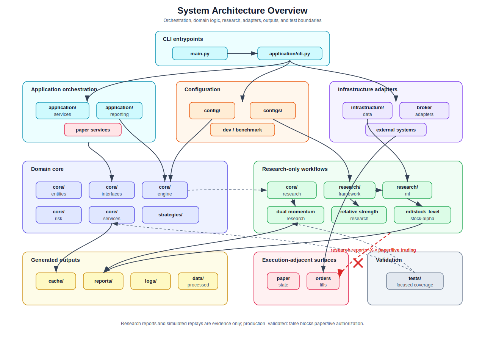
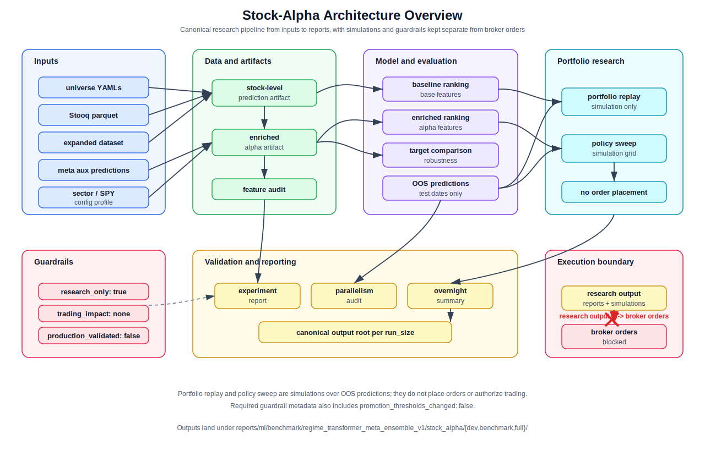
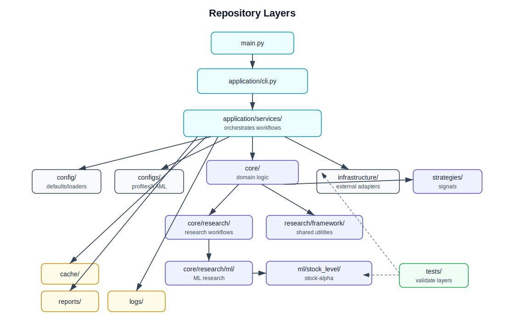
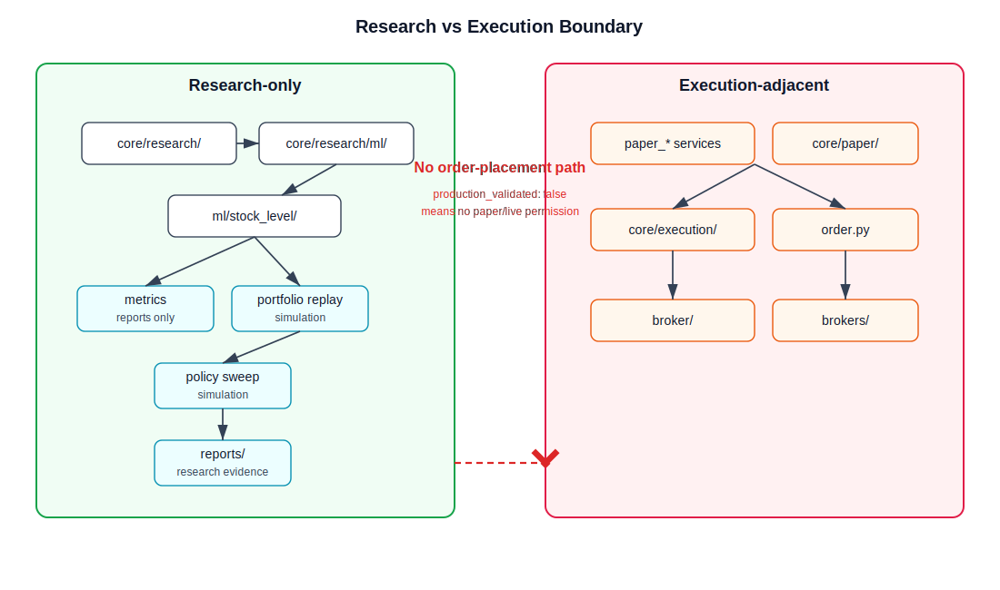
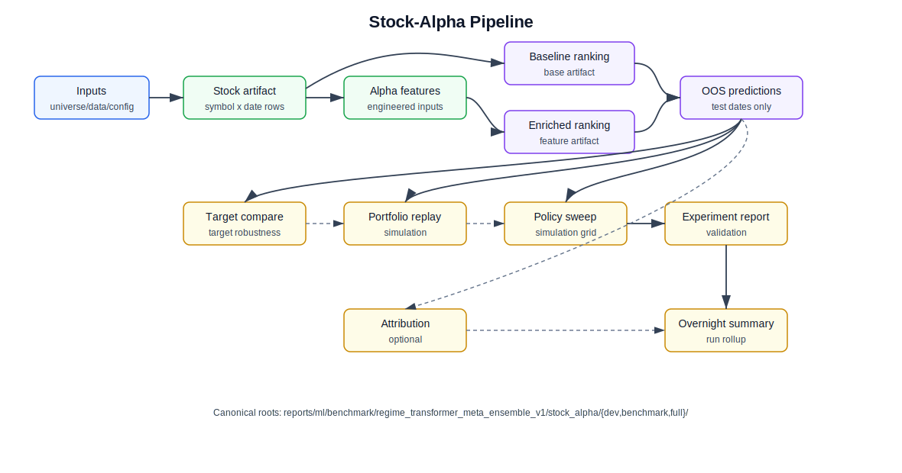
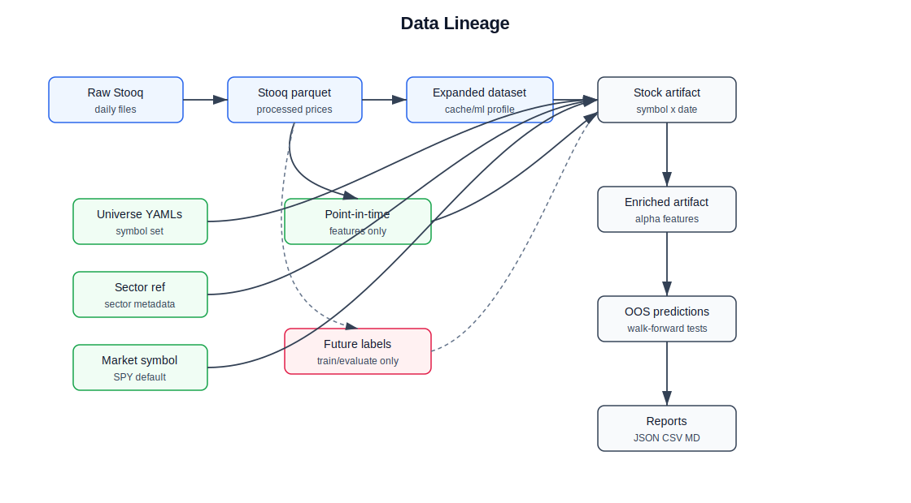
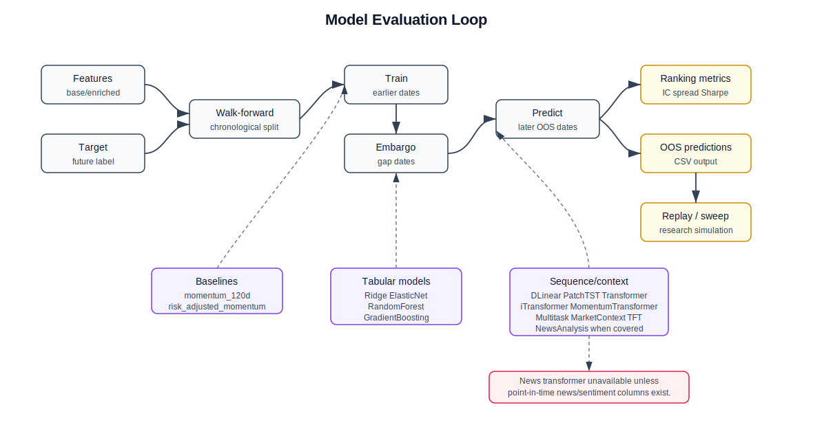
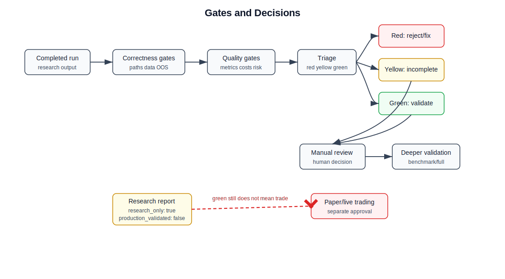
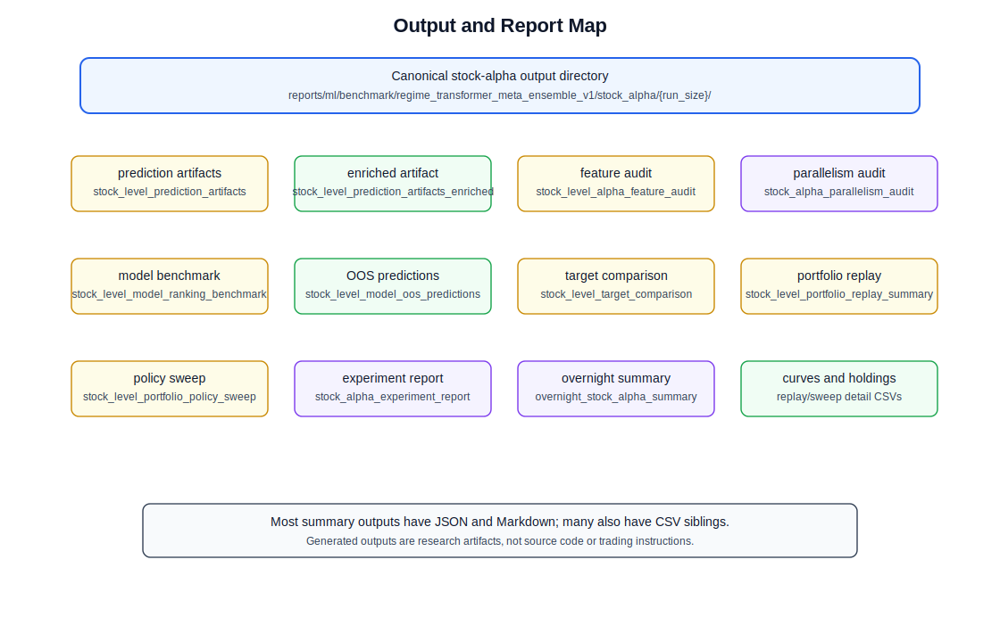

# Architecture Diagrams

This diagram-first guide maps the repository, research workflow, stock-alpha
pipeline, data lineage, evaluation loop, decision gates, and output locations.
It starts with two overview diagrams for fast orientation, then keeps the
existing drill-down diagrams below. The diagrams are documentation assets; they
are not benchmark evidence and do not claim production validation.

Research outputs remain research-only. Portfolio replay and policy sweep stages
are simulations over out-of-sample predictions. They do not authorize paper or
live trading, and stock-alpha reports continue to carry:

| Guardrail | Required value |
| --- | --- |
| `research_only` | `true` |
| `trading_impact` | `none` |
| `production_validated` | `false` |
| `promotion_thresholds_changed` | `false` |

For deeper box-by-box explanations, see
[architecture_diagram_explainer.md](architecture_diagram_explainer.md). For
stock-alpha feature, target, model, and gate interpretation, see
[stock_alpha_feature_explainer.md](stock_alpha_feature_explainer.md) and
[model_and_gate_explainer.md](model_and_gate_explainer.md).

## System Architecture Overview

The system overview shows the main repository layers, their intended dependency
direction, and the blocked path from research evidence to paper/live execution.

### Box reference

| Box | Purpose | Inputs | Outputs | Notes |
| --- | --- | --- | --- | --- |
| CLI entrypoints | Start command-line workflows and route user intent. | Mode, profile, flags, environment. | Calls into `application/cli.py` and application services. | Entry code should stay thin and orchestration-focused. |
| Application orchestration | Coordinates backtest, research, reporting, and paper-adjacent workflows. | Config objects, services, adapters, domain objects. | Workflow calls, report writers, paper service actions where explicitly requested. | Orchestration should not hide strategy, risk, or model rules. |
| Configuration | Loads defaults, YAML profiles, and runtime options. | `config/`, `configs/`, development and benchmark profiles. | Runtime config used by application and research stages. | Config should keep research guardrails explicit. |
| Domain core | Holds reusable domain entities, interfaces, engines, risk, services, and strategies. | Signals, fills, prices, market data, strategy context. | Portfolio state, simulated fills, risk decisions, domain outputs. | Keep broker and data-provider details behind interfaces. |
| Research-only workflows | Runs classic research, ML research, stock-alpha research, and shared research utilities. | Research configs, datasets, features, labels, model settings. | Metrics, predictions, reports, simulated replay outputs. | Research reports are evidence only and must not place orders. |
| Infrastructure adapters | Connects external data, broker, persistence, and logging systems. | External data sources, broker APIs, local persistence paths. | Adapter data, broker responses, stored records. | Adapter code should not contain strategy logic. |
| Generated outputs | Stores cache, reports, logs, and processed data. | Application and research stage results. | CSV, JSON, Markdown, logs, parquet, cache files. | Generated outputs are not source dependencies. |
| Execution-adjacent surfaces | Represents paper state, orders, fills, and broker-facing concepts. | Approved execution requests and broker adapter responses. | Paper/live state, orders, fills. | Research-to-execution is blocked while `production_validated: false`. |
| Tests | Validates architecture rules and focused behavior. | Fixtures, fakes, sample artifacts. | Pytest results and guardrail checks. | Docs validation here does not require running benchmarks. |

## Stock-Alpha Architecture Overview

The stock-alpha overview shows the full research architecture from inputs to
artifacts, model evaluation, simulated portfolio research, validation reports,
and execution guardrails.

### Box reference

| Box | Purpose | Inputs | Outputs | Notes |
| --- | --- | --- | --- | --- |
| Inputs | Collect the data and configuration needed for stock-alpha research. | Universe YAMLs, processed Stooq parquet, expanded rebalance data, meta auxiliary predictions, sector reference, SPY market symbol, profile config. | Stage-ready research inputs. | Inputs should be resolved before artifact generation. |
| Data and artifacts | Creates the base stock-level table and enriched alpha feature table. | Rebalance rows, point-in-time market data, labels, auxiliary predictions, sector and market context. | Base artifact, enriched artifact, feature audit. | Base and enriched artifacts should live under the canonical run-size output root. |
| Model and evaluation | Compares baseline and enriched ranking behavior on chronological OOS splits. | Base/enriched artifacts, target definitions, model settings. | Ranking metrics, target comparison outputs, OOS predictions. | Portfolio stages should consume OOS predictions only. |
| Portfolio research | Simulates portfolio behavior and policy alternatives. | OOS predictions, replay settings, policy sweep grid, price data. | Replay reports, sweep tables, candidate policy evidence. | Replay and sweep are simulations only. |
| Validation and reporting | Consolidates experiment evidence and run metadata. | Stage outputs, metrics, paths, parallelism settings, guardrails. | Experiment report, parallelism audit, overnight summary. | Reports should include output-root metadata and preserve guardrails. |
| Guardrails | Records non-production status for research artifacts. | Config defaults and report metadata. | `research_only: true`, `trading_impact: none`, `production_validated: false`, `promotion_thresholds_changed: false`. | These values block execution promotion. |
| Execution boundary | Makes the forbidden research-to-broker path visible. | Research reports and simulated portfolio evidence. | No broker orders. | Research output must not be reused as an order instruction. |
| Canonical output root | Separates `dev`, `benchmark`, and `full` outputs. | Active `run_size`. | `reports/ml/benchmark/regime_transformer_meta_ensemble_v1/stock_alpha/{dev,benchmark,full}/`. | Legacy paths should be explicit if allowed. |

## Repository Layers

The repository keeps CLI entrypoints and application orchestration above core
domain logic, with infrastructure adapters and generated outputs outside the
core trading model.

### Box reference

| Box | Purpose | Inputs | Outputs | Notes |
| --- | --- | --- | --- | --- |
| `main.py` | CLI entrypoint for research and trading commands. | User-selected mode, profile, flags. | Delegates to application CLI. | Should stay thin and orchestration-only. |
| `application/` | Coordinates services, reporting, and command flows. | Config objects, domain services, infrastructure adapters. | Backtest, research, paper-service, and report workflows. | Application code may orchestrate but should not embed strategy rules. |
| `config/` and `configs/` | Typed config loading and YAML profile defaults. | YAML files, environment, CLI overrides. | Runtime configuration objects. | Config changes should preserve explicit research guardrails. |
| `core/` | Pure trading and research domain logic. | Signals, fills, prices, research rows, model inputs. | Portfolio state, risk decisions, metrics, research artifacts. | Core code should remain broker- and data-provider-agnostic. |
| `infrastructure/` | External adapters for data, broker, persistence, and logging. | Provider credentials, broker APIs, local storage. | Adapter responses and persisted records. | No strategy or portfolio rules belong here. |
| `strategies/` | Strategy implementations and research strategy modules. | Market data, indicators, model outputs. | Signals and research features. | Strategies produce signals, not broker orders. |
| `reports/`, `cache/`, `logs/` | Generated run outputs and transient artifacts. | Application and research stages. | CSV, JSON, Markdown, logs, caches. | These directories are outputs, not source dependencies. |
| `tests/` | Regression and architecture validation. | Fakes, fixtures, focused input artifacts. | Pytest results and guardrail assertions. | Tests should avoid broker/paper/live side effects unless explicitly scoped. |

## Research Vs Execution Boundary

Research modules may produce features, predictions, metrics, reports, simulated
portfolio replays, and policy sweeps. Those outputs are evidence for review,
not execution instructions.

### Box reference

| Box | Purpose | Inputs | Outputs | Notes |
| --- | --- | --- | --- | --- |
| `core/research/` | Shared research framework and validation logic. | Research configs, datasets, model definitions. | Metrics, reports, diagnostics. | Must not place, cancel, or query broker orders. |
| `core/research/ml/stock_level/` | Stock-alpha artifact, feature, ranking, and evaluation stages. | Stock-level artifacts, features, targets, OOS splits. | Stock-alpha outputs under the active run root. | Outputs remain research-only even when metrics are positive. |
| Metrics and validation reports | Summarize correctness, quality, and candidate status. | Stage artifacts and OOS predictions. | JSON, CSV, Markdown summaries. | Metrics observe results; they do not control execution. |
| Portfolio replay | Simulates ranking-based portfolio behavior. | OOS predictions, policy parameters, prices. | Replay curves and summary metrics. | Replay is not paper trading. |
| Portfolio policy sweep | Compares simulated policy settings. | OOS predictions, replay configuration. | Sweep tables and selected candidates. | Policy candidates still require manual review. |
| Boundary | Blocks direct movement from research evidence to order placement. | Research summaries and guardrail metadata. | Explicit non-production status. | `production_validated: false` means no paper/live permission. |
| Paper/live services and broker adapters | Execution-adjacent surfaces. | Approved orders, broker credentials, runtime state. | Broker requests, fills, paper/live state. | Not part of this docs task and not modified here. |

## Stock-Alpha Pipeline

All stock-alpha overnight stages should share the same canonical output
directory for the active run size:

| Run size | Canonical output directory |
| --- | --- |
| `dev` | `reports/ml/benchmark/regime_transformer_meta_ensemble_v1/stock_alpha/dev/` |
| `benchmark` | `reports/ml/benchmark/regime_transformer_meta_ensemble_v1/stock_alpha/benchmark/` |
| `full` | `reports/ml/benchmark/regime_transformer_meta_ensemble_v1/stock_alpha/full/` |

### Box reference

| Box | Purpose | Inputs | Outputs | Notes |
| --- | --- | --- | --- | --- |
| Inputs | Collect universe, research profile, parquet market data, and reference data. | Config profiles, universe YAML, Stooq parquet, market symbol. | Stage-ready stock-level inputs. | Inputs should be resolved before stage execution. |
| Stock-level artifact | Builds the base per-symbol prediction artifact. | Rebalance dataset, symbol universe, market context, labels. | `stock_level_prediction_artifacts.csv`, `.json`, `.md`. | Files should land under the canonical run-size output directory. |
| Alpha features | Adds engineered stock-alpha features and audits coverage. | Canonical stock-level artifact. | Enriched artifact and feature audit files. | Must read the canonical artifact path when legacy paths are disabled. |
| Baseline ranking | Benchmarks base artifact without engineered alpha features. | Base artifact, target column, model config. | Baseline ranking metrics and OOS predictions. | Used as the comparison floor. |
| Enriched ranking | Benchmarks enriched alpha feature set. | Enriched artifact, target column, model config. | Enriched ranking metrics and OOS predictions. | Evaluates whether alpha features improve ranking quality. |
| Target comparison | Compares supported target definitions. | Enriched artifacts and configured target columns. | Target comparison CSV, JSON, Markdown. | Helps select robust target definitions. |
| Portfolio replay | Simulates portfolio behavior on OOS predictions. | OOS predictions, replay policy, price data. | Replay metrics, curves, and reports. | Simulation-only, not paper/live execution. |
| Policy sweep | Searches simulated portfolio policy parameters. | OOS predictions, sweep grid, constraints. | Policy sweep outputs and selected candidates. | Candidate policies still need review. |
| Experiment report | Consolidates model, target, replay, and sweep evidence. | All upstream stage outputs. | `stock_alpha_experiment_report.*`. | Must preserve research-only guardrails. |
| Optional attribution | Explains feature contribution where configured. | OOS model artifacts and feature matrix. | Attribution CSV, JSON, Markdown. | Optional and should not block unrelated reports unless configured as required. |
| Overnight summary | Records final stage status and output metadata. | Stage statuses, paths, guardrails, metrics. | `overnight_stock_alpha_summary.*`. | Should include output root, output dir, run size, legacy-path flag, and stage paths. |

## Data Lineage

Feature rows should use point-in-time inputs. Future labels are training and
evaluation targets only; they must not become same-row features.

### Box reference

| Box | Purpose | Inputs | Outputs | Notes |
| --- | --- | --- | --- | --- |
| Raw Stooq daily files | Source price and volume data. | Downloaded raw market files. | Raw daily records. | External source data should remain separate from processed artifacts. |
| Processed Stooq parquet | Efficient local market-data store. | Raw daily files and processing rules. | Parquet datasets. | Used by research feature and label builders. |
| Universe YAML | Defines included symbols. | Repository reference files. | Symbol universe. | Universe selection affects artifacts and evaluation coverage. |
| Sector and market references | Provide contextual features. | Reference mappings and market proxy symbol. | Sector labels and market context. | Missing reference coverage should be visible in audits. |
| Expanded rebalance dataset | Intermediate rebalance-date data. | Universe, price data, schedule, cache profile. | Expanded research rows. | May live in cache for development or benchmark runs. |
| Point-in-time features | Historical information available at the row date. | Past prices, volume, market context, sector context. | Momentum, volatility, drawdown, liquidity, relative-strength features. | These may be used as model features. |
| Future labels | Forward-looking outcomes. | Future returns and realized risk windows. | Forward return, residual return, future volatility or drawdown labels. | Labels are targets only and must not leak into same-row features. |
| Stock-level artifact | Base modeling table. | Rebalance rows, point-in-time features, target labels. | `stock_level_prediction_artifacts.csv`. | Should retain lineage metadata and coverage diagnostics. |
| Enriched artifact | Feature-augmented modeling table. | Base artifact and engineered alpha features. | `stock_level_prediction_artifacts_enriched.csv`. | Feeds enriched model ranking and target comparison. |
| OOS predictions and reports | Evaluation outputs. | Chronological model predictions. | Prediction tables, metrics, reports. | Downstream portfolio stages consume OOS predictions only. |

## Model Evaluation Loop

The stock-alpha benchmark should use chronological out-of-sample evaluation.
Training happens on earlier dates, predictions are made on later dates, and
portfolio simulations consume OOS predictions rather than in-sample scores.

### Box reference

| Box | Purpose | Inputs | Outputs | Notes |
| --- | --- | --- | --- | --- |
| Feature rows | Candidate predictor matrix. | Base or enriched artifact columns. | Model-ready rows. | Feature availability and coverage should be audited. |
| Target column | Defines the optimization/evaluation label. | Forward return or comparison target. | Target vector. | Target choice should be recorded in reports. |
| Chronological split | Separates earlier training dates from later OOS dates. | Rebalance dates and split config. | Train/test windows. | Avoids random cross-sectional leakage across time. |
| Training window | Fits model candidates. | Earlier-dated feature rows and targets. | Fitted model state. | May include baseline, tabular, and sequence/context models. |
| Embargo dates | Keeps adjacent windows separated where configured. | Split dates and embargo size. | Excluded dates between train and test. | Reduces lookahead and overlap risk. |
| OOS prediction window | Scores later dates only. | Fitted models and later-dated feature rows. | OOS predictions. | Portfolio replay and sweep should use this output. |
| Ranking metrics | Evaluates prediction quality. | Predictions and realized targets. | IC, spread, hit rate, spread Sharpe, model ranking. | Metrics inform research triage, not trade execution. |
| Model families | Candidate model groups. | Baseline, tabular, and sequence/context configurations. | Candidate predictions and metrics. | News models require point-in-time news/sentiment coverage. |

## Gates And Decisions

Green research status means a candidate is worth deeper validation. It still
does not mean trade, paper-trade, or promote.

### Box reference

| Box | Purpose | Inputs | Outputs | Notes |
| --- | --- | --- | --- | --- |
| Completed research run | Marks that configured stages finished. | Stage status and artifact paths. | Candidate for gate checks. | Completion alone is not evidence of quality. |
| Correctness gates | Check that required artifacts are present and coherent. | Canonical root, freshness, targets, OOS predictions, feasible winners. | Pass/fail correctness status. | Legacy output mixing should fail when disabled. |
| Quality gates | Check model and portfolio simulation quality. | Ranking metrics, replay metrics, sweep metrics. | Red/yellow/green candidate signal. | Gates should not be loosened as part of documentation or plumbing fixes. |
| Candidate triage | Classifies the research result. | Correctness and quality statuses. | Red, yellow, or green status. | Triage supports manual review. |
| Research report | Records evidence and guardrails. | Metrics, paths, configs, gate status. | Markdown, JSON, CSV summaries. | Must include research-only and non-production metadata. |
| Manual review | Human evaluation of evidence and risks. | Reports, lineage, diagnostics, assumptions. | Decision to rerun, reject, or deepen validation. | Required before any broader validation path. |
| Deeper validation | Larger or more robust research run. | Green candidate plus review notes. | Additional benchmark/full evidence. | Still not execution authorization. |
| Paper/live blocked | Prevents direct promotion from research output. | Research report and guardrail status. | No broker/paper/live action. | `production_validated: false` blocks execution permission. |

## Output And Report Map

Generated stock-alpha outputs should remain under the active canonical output
directory. Legacy paths such as `reports/ml/benchmark/ml/` should not be used
unless legacy output paths are explicitly enabled.

### Box reference

| Box | Purpose | Inputs | Outputs | Notes |
| --- | --- | --- | --- | --- |
| Canonical output root | Single destination for an active stock-alpha run size. | Resolved run size and model family root. | `.../stock_alpha/{dev,benchmark,full}/`. | All stages should share this directory. |
| Artifact files | Base stock-level stage outputs. | Stock-level artifact generation. | `stock_level_prediction_artifacts.csv`, `.json`, `.md`. | These are the first files downstream stages should read. |
| Feature files | Alpha feature stage outputs. | Canonical base artifact. | Enriched artifact and feature audit files. | Feature stage should not search legacy roots when disabled. |
| Ranking files | Model ranking outputs. | Base/enriched artifacts and model configs. | Ranking metrics and OOS predictions. | Model ranking feeds reports and portfolio simulations. |
| Target comparison files | Target robustness outputs. | Candidate targets and enriched artifacts. | Target comparison tables and summaries. | Helps compare target definitions. |
| Replay and sweep files | Simulated portfolio outputs. | OOS predictions, replay/sweep settings. | Replay curves, sweep tables, policy summaries. | Simulation-only evidence. |
| Experiment report | Human-readable research summary. | Upstream stage outputs. | `stock_alpha_experiment_report.*`. | Should preserve guardrails and active output paths. |
| Optional attribution files | Feature contribution diagnostics. | Model outputs and feature data. | Attribution reports. | Optional and scoped to configured attribution runs. |
| Overnight summary | Final run manifest. | Stage output paths, output root metadata, guardrails. | `overnight_stock_alpha_summary.*`. | Should list output root, output dir, run size, legacy-path setting, and stage paths. |

## Related Documentation

For deeper context, see:

| Topic | Document |
| --- | --- |
| Architecture overview | [architecture_overview.md](architecture_overview.md) |
| Repository structure | [project_structure.md](project_structure.md) |
| Stock-alpha deep dive | [stock_alpha_pipeline_deep_dive.md](stock_alpha_pipeline_deep_dive.md) |
| Architecture diagram explainer | [architecture_diagram_explainer.md](architecture_diagram_explainer.md) |
| Stock-alpha feature explainer | [stock_alpha_feature_explainer.md](stock_alpha_feature_explainer.md) |
| Model and gate explainer | [model_and_gate_explainer.md](model_and_gate_explainer.md) |
| Stock-alpha runbook | [stock_alpha_research_runbook.md](stock_alpha_research_runbook.md) |
| Research gates | [research_gates_and_trade_conditions.md](research_gates_and_trade_conditions.md) |
| Research outputs | [research_outputs_guide.md](research_outputs_guide.md) |
| Data lineage | [data_lineage.md](data_lineage.md) |
